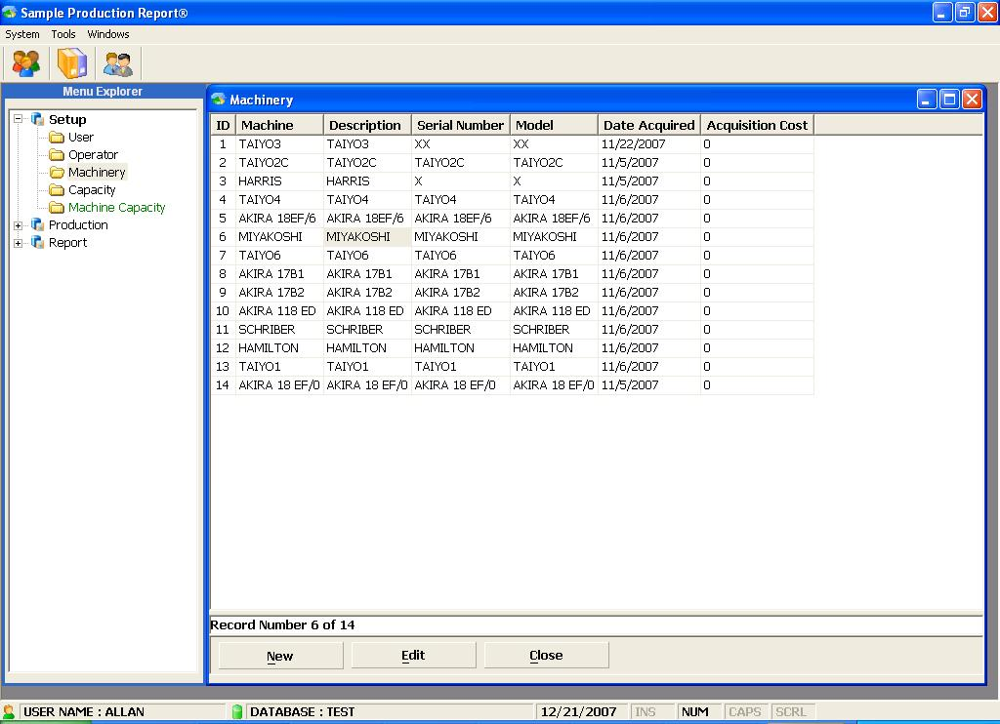



## Production Report\(A 3\-Tired Application using ADO

### Description

This is a way of expressing my sincerest thanks (to all Developers who contributed and continously

sharing their ideas to VB community) by providing at least one sample appplication that would give an idea

to Beginners as well as in the Intermediate level of Database programming of what an N-Tier application is all

about. This is a transaction oriented-application (see your SQl Profiler)capable of accessing database through stored procedures and without single

Adhoc queries involved. Business rules were implemented through the middle layer which you can compile as in process dll at anytime

and used it by setting the reference and instantiate to exposed its objects. An option to change your connection has been

included during logon to allow user to change database connection. All exeptions are handled by error trapping code so don't

worry about unexpected closing of application. I have also added some crystal report functionality and show how to use

TTX files(Field Definitions Only) on stored procedure. Should there be any bug occured during runtime, please send the details to me. Thanks and Please vote.
 
### More Info
 

             |
---                |---
**Submitted On**   |2007-12-04 11:09:44
**By**             |[Allan V\. Pelayo](https://github.com/Planet-Source-Code/PSCIndex/blob/master/ByAuthor/allan-v-pelayo.md)
**Level**          |Advanced
**User Rating**    |4.8 (19 globes from 4 users)
**Compatibility**  |VB 6\.0
**Category**       |[Databases/ Data Access/ DAO/ ADO](https://github.com/Planet-Source-Code/PSCIndex/blob/master/ByCategory/databases-data-access-dao-ado__1-6.md)
**World**          |[Visual Basic](https://github.com/Planet-Source-Code/PSCIndex/blob/master/ByWorld/visual-basic.md)
**Archive File**   |[Production20945812212007\.zip](https://github.com/Planet-Source-Code/allan-v-pelayo-production-report-a-3-tired-application-using-ado__1-69788/archive/master.zip)

